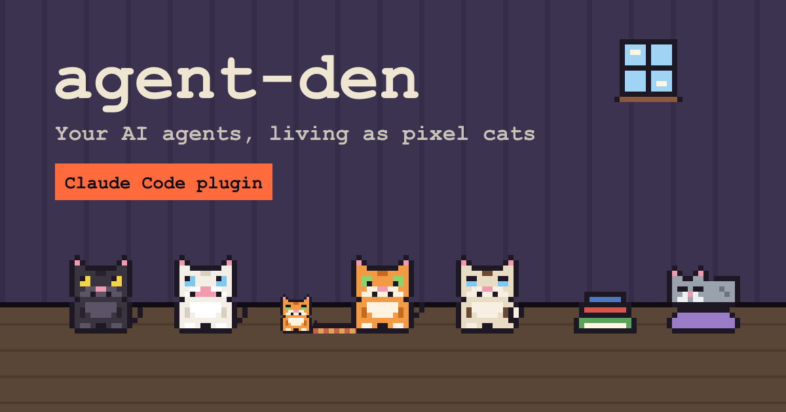

# agent-den

<p align="center">
  
</p>

## Description

Watch your AI coding agents live in a pixel-art den. Every Claude Code session is a character, its subagents are
its young, and every project folder is a room. Characters walk to the station of the tool they're using and show what
they are doing at a glance: thinking, working, waiting for you, done.

The den is skinnable. It ships with the **cats** skin: sessions are cats, subagents are kittens. Cats sniff books while
reading, scratch the post while editing, knock things off the table while running shell commands, stare out of the
window while browsing the web and yowl at the door when they need your permission. Kittens hop out of a box, done cats
nap on the cushion. More skins are on the way.

Workspaces:

| Package                  | Path                                           | Description                                                                       |
| ------------------------ | ---------------------------------------------- | --------------------------------------------------------------------------------- |
| **@agent-den/web**       | [`apps/web/`](apps/web/)                       | Angular 22 web app: the den (zoneless, signals, Feature-Sliced Design)            |
| **@agent-den/collector** | [`apps/collector/`](apps/collector/)           | Node + Hono service on `127.0.0.1:4317`: hooks in, agent state out over WebSocket |
| **@agent-den/contracts** | [`packages/contracts/`](packages/contracts/)   | Events, agent state and the reducer shared by collector and web                   |
| **@agent-den/mock**      | [`tools/mock/`](tools/mock/)                   | Dev-only generator of fake sessions                                               |
| Claude Code plugin       | [`plugins/claude-code/`](plugins/claude-code/) | Hooks that forward session, tool and subagent events to the collector             |

How it fits together:

```
Claude Code ──hooks──▶ plugin (send.mjs) ──HTTP──▶ collector ──WebSocket──▶ den in the browser
                                                     ▲
                                  ~/.claude/projects/*.jsonl (transcripts: backfill + reconciliation)
```

## Use it (no repository needed)

Needs [Claude Code](https://claude.com/claude-code) and `node` 22+ on `PATH`. In Claude Code:

```
/plugin marketplace add a1exevs/agent-den
/plugin install agent-den@agent-den
```

`a1exevs/agent-den` is cloned over SSH; without a GitHub SSH key add `https://github.com/a1exevs/agent-den.git`
instead.

Start a new session: the plugin starts the den in the background by itself. Then run `/agent-den:den` to open it
(http://localhost:4317). Sessions that were already running show up from their transcripts.

To get new versions automatically, turn on auto-update for the `agent-den` marketplace in `/plugin` → Marketplaces
(it is off by default for third-party marketplaces). Or update by hand: `/plugin marketplace update agent-den`.

The collector listens on `127.0.0.1` only. It keeps the den in `den-state.json` (so updates and reboots don't empty
it) and writes `collector.log`, both in the data folder Claude Code gives the plugin (`CLAUDE_PLUGIN_DATA`).

## Develop

Prerequisites: Node **22.22.3** or newer (`^22.22.3 || ^24.15.0 || >=26`), npm **10.9.8**.

From the **repository root**:

```bash
npm install
```

```bash
npm run dev:collector
```

```bash
npm run dev:web
```

Open http://localhost:4210 (the dev server proxies `/ws` to the collector). No Claude Code at hand? Run
`npm run dev:mock` for a den full of fake agents. With the dev collector running, the installed plugin's launcher
leaves it alone (it reports version `dev`).

## Available scripts

Run from the **repository root**.

### Development

| Command                 | Description                                                                                            |
| ----------------------- | ------------------------------------------------------------------------------------------------------ |
| `npm run dev:collector` | Collector on `127.0.0.1:4317` with watch                                                               |
| `npm run dev:web`       | Angular dev server on http://localhost:4210                                                            |
| `npm run dev:web:fresh` | Same, after clearing `.angular/cache` (needed after changing `packages/contracts` or `tsconfig` paths) |
| `npm run dev:mock`      | Streams fake sessions, tools and subagents into the collector                                          |

### Quality

| Command                                   | Description                                                                                    |
| ----------------------------------------- | ---------------------------------------------------------------------------------------------- |
| `npm run lint`                            | Everything below plus ESLint (FSD imports, cycles, segment direction), Steiger (FSD) and `tsc` |
| `npm run lint:structure`                  | FSD folders and `index.ts` placement, kebab-case names                                         |
| `npm run lint:unused`                     | knip: unused files, exports and dependencies                                                   |
| `npm run format` / `npm run format:check` | Prettier                                                                                       |
| `npm test`                                | Vitest in every workspace                                                                      |
| `npm run build`                           | Build every workspace                                                                          |
| `npm run build:plugin`                    | Pack the collector and the built den into `plugins/claude-code/den` (committed)                |

### Tooling

| Command                  | Description                                                                                        |
| ------------------------ | -------------------------------------------------------------------------------------------------- |
| `npm run generate:icons` | Regenerate favicons, app icons and the OG image in `apps/web/public` from the code-defined sprites |
| `npm run rules:sync`     | Regenerate `.claude/rules` from `.cursor/rules` (the single source of coding rules)                |

## Releasing the plugin

1. Bump `version` in `plugins/claude-code/.claude-plugin/plugin.json` — users only get an update when it changes.
2. `npm run build:plugin` — packs the collector and the den into `plugins/claude-code/den`. Commit the result:
   marketplaces install the plugin folder exactly as it is in git. The build refuses changed sources under an
   already built version, and `npm run lint` fails when `plugin.json` and the build disagree.
3. Push to `main`.
4. Users with auto-update get it on the next start; others run `/plugin marketplace update agent-den`. The first new
   session replaces a collector left over from the previous version; sessions still on an older version never
   downgrade it.

## Features

- Live sessions from Claude Code hooks, plus transcript backfill for sessions started before the plugin
- Subagents live next to their parent, always in its room
- A station per tool category: read, edit, shell, web, subagents, rest, the door in and out
- Precise statuses: thinking, using a tool, waiting for you, done, interrupted (Esc), error; dusty characters for stale
  sessions
- Details panel with the live transcript of any session or subagent
- Collapsible rooms and a roster toolbar to find an agent quickly
- A sound when an agent needs you and when a session is done, a different voice per character (cats: meow and purr)
- Browser notifications while the tab is in the background; click one to open that agent
- Send agents home: hide finished sessions with undo, nothing is ever lost
- Skins: every look (sprites, stations, sounds, names) is one pluggable skin; cats come first
- Private by design: the collector listens on loopback only and rejects non-local origins

## Coding rules

Coding rules for agents live in [`.cursor/rules`](.cursor/rules) and are generated into `.claude/rules`;
[`AGENTS.md`](AGENTS.md) is the project guide for every coding agent.

## Credits

- Cat sounds: [BigSoundBank](https://bigsoundbank.com/) by Joseph Sardin, CC0 — see
  [`apps/web/public/sounds/README.md`](apps/web/public/sounds/README.md)
- UI primitives: [Spartan](https://www.spartan.ng/) brain

## Repository

- Repository: https://github.com/a1exevs/agent-den

## License

[MIT](LICENSE)
